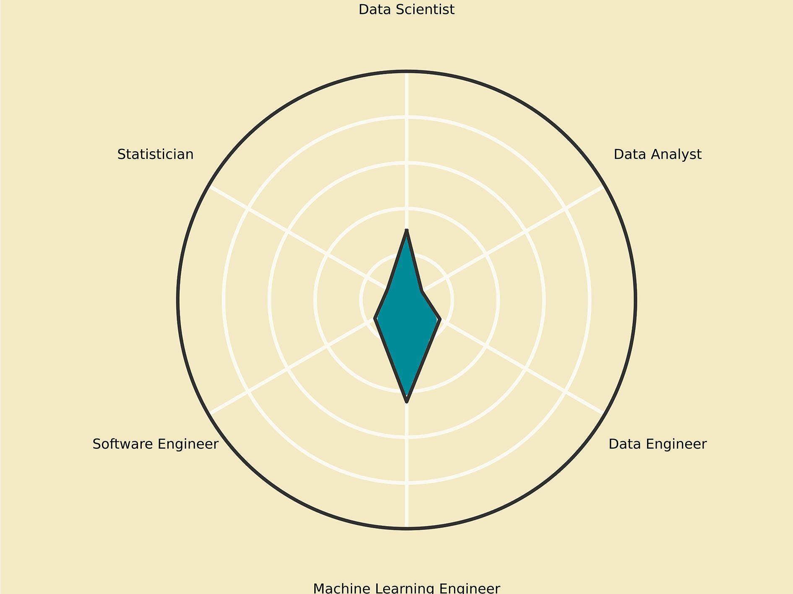

# WhyDataSciencePopular
## Complete Results can be found at VisualResults
## EmploymentGenderRatio

## EmployeeLocation

## EducationLevel

## IndustryType

## CompanyLocation & CompanyName

## BasicTools
### CV

### FrameWork

### NLP

### ML

## WordCloud
### DA

### DE

### DS

### MLE

### SE

### Sta

## SalaryDistribution

## SalaryInfluencialFactors

## CorrelationMatrix

